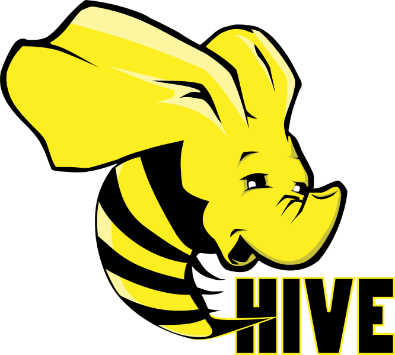

# Changelog

All notable changes to this project will be documented in this file.

The format is based on [Keep a Changelog](https://keepachangelog.com/en/1.0.0/),
and this project adheres to [Semantic Versioning](https://semver.org/spec/v2.0.0.html).

## [Unreleased] CHANGE_ME

### new feature CHANGE_ME

- Added Dutch translation

### Fixed CHANGE_ME

- Fixed foldouts in Dutch translation

## [1.0.1] - 2021-12-29 CHANGE_ME ([major.minor.patch])

### new feature CHANGE_ME

- airflow volume mount paths
- docker images build paths

### Removed CHANGE_ME

- Terraform execution control files

## [1.0.0] - 2021-12-20 CHANGE_ME

### Added CHANGE_ME

- Terraform infrastructure with 
  -  PostgreSQL
  - adminer, 
  -  Apache hadoop hdfs, 
  -  Apache Hive, 
  - webhcat, 
  -  hue, 
  -  Apache Spark, 
  - livy, 
  -  Apache Airflow