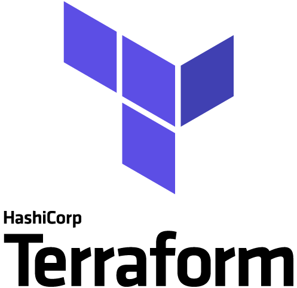

# environment #

## Quick summary  

 Terraform infrastructure containing: 

### network <!--TODO: CHANGE_ME-->

- 1 network called `airflow-celery-net`

### containers  <!--TODO: CHANGE_ME-->

- 1  [PostgreSQL](#postgresql)
- 1  [airflow](#airflow)

# container descriptions #

## PostgreSQL <!--TODO: CHANGE_ME-->

### software <!--TODO: CHANGE_ME-->

- PostgreSQL 13.5
- debian 11 (bullseye)

### exposed ports (host:container) <!--TODO: CHANGE_ME-->

- 5432:5432

### container specific info <!--TODO: CHANGE_ME-->

#### database <!--TODO: CHANGE_ME-->
| database name | user    | password |
|---------------|---------|----------|
| airflow_db    | airflow | airflow  |

## airflow <!--TODO: CHANGE_ME-->

### software <!--TODO: CHANGE_ME-->

- airflow 2.2.2
  - extras
    - celery
    - postgres
    - apache.hive
    - jdbc
    - mysql
    - ssh
    - redis
- python 3.7
- pip 21.2.4
- git 2.20.1
- netcat
- debian 10 (buster)

### exposed ports (host:container)  <!--TODO: CHANGE_ME-->

- 8080:8080

### container specific info  <!--TODO: CHANGE_ME-->

#### URL  <!--TODO: CHANGE_ME-->

http://localhost:8080/

|              |         |
|--------------|---------|
| **Username** | airflow |
| **Password** | airflow |

